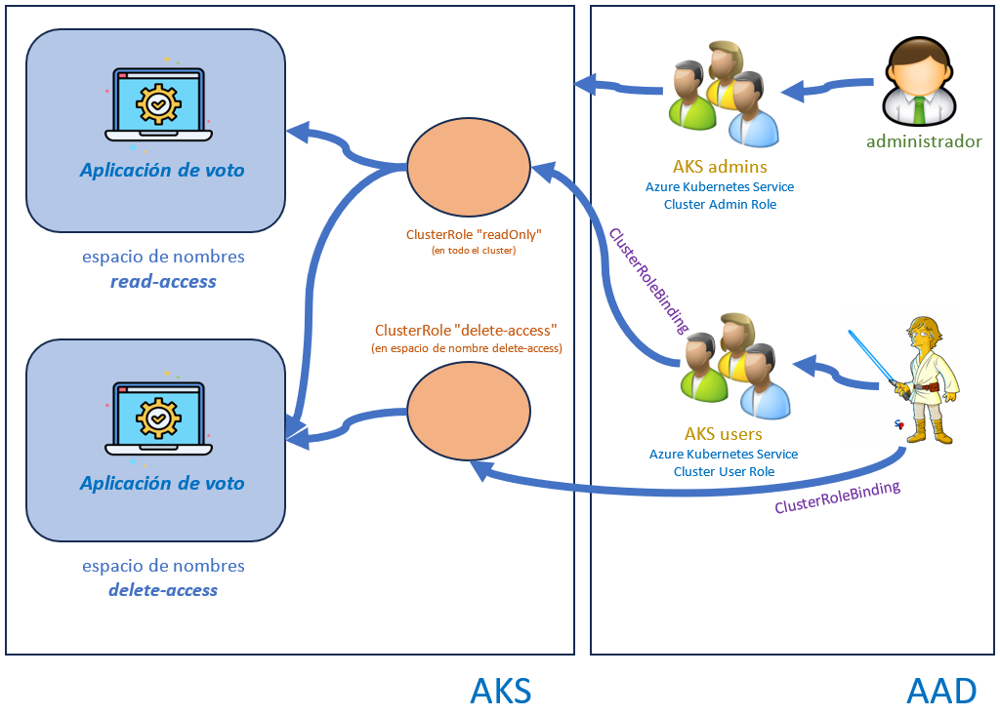

# Laboratorio 65-C: ***RBAC en AKS (AZURE)***
 
En este laboratorio aprenderemos a integrar RBAC de Kubernetes en AKS.

Requisitos:

1. Una máquina virtual con Ubuntu 20.04 LTS a la que poder hacer ssh o escritorio remoto.
2. Cluster AKS. (Ver lab-00.md)
3. IMPORTANTE!!!!! Disponer de credenciales de Global Administrator en la subscripción de Azure. Como el alumno en el curso no la va a tener, este laboratorio se realizará como una demo.


## Ejercicio 1. ***Introduccion a RBAC***

Hasta el momento, hemos tenido permisos para crear, leer, actualizar y eliminar objetos en el cluster. Esto funciona bien en un entorno de prueba, pero no es recomendable para uno de producción.

En los clusters de producción, la recomendación es aprovechar RBAC y conceder un conjunto limitado de permisos a los usuarios. Será necesario configurar RBAC en Kubernetes e intregrarlo con ***Azure AD***.

RBAC tiene 3 conceptos importantes:

* *Role*: Contiene un conjunto de permisos. Por defecto, el rol no tiene ningún permiso y en consecuencia hay que especificarlos. Los permisos son del tipo ***get***, ***watch***, ***list***... Se les llama ***verbos***. Aquí los verbos admitidos por el API Server: https://kubernetes.io/docs/reference/access-authn-authz/authorization/#determine-the-request-verb. El rol también contiene los recursos a los que se aplican esos permisos. Los recursos pueden ser todos los ***pods***, los ***deployments***, etc, o pueden ser un objeto concreto, como ***pod/mypod***.

* *Subject*: Se refiere a la persona o a la cuenta de servicio a la que se asigna el rol. En los clusteres de AKS integrados con AAD, el subject puede ser un ***usuario*** o un ***grupo*** de AAD.

* *RoleBinding*: Sirve para enlazar un subject a un rol para un contexto. Si es ***CusterRoleBinding***, se refiere a la totalidad del cluster.

Un concepto importante a comprender es que hay dos capas de RBAC: Los RBAC de Azure y los RBAC de Kubernetes.


Los RBAC de Azure tienen que ver con los roles asignados a las personas para hacer ***cambios en Azure***, como crear, modificar o borrar clústeres. Los RBAC de Kubernetes tienen que ver con el ***derecho de acceso*** a los recursos del cluster.

Los RBACs de Kubernetes son una característica OPCIONAL. Por defecto los clusters que se crean tienen RBAC habilitado, sin embargo no están integrados con Azure AD. Esto significa que no se pueden dar permisos de Kubernetes a usuarios de AAD, y habría que integrarlo.

Para aclarar la práctica que tendremos que hacer, estudia la siguiente imagen.




## Ejercicio 2. ***Habilitar la integración de Azure AD en AKS***

Una vez que el cluster ha sido integrado con Azure AD, esta funcionalidad no puede ser deshabilitada Empezamos creando un grupo en Azure AD al que le asignaremos permisos en AKS:
```
AKS_ADMIN_GROUP_ID=$(az ad group create \
    --display-name "aks admins" \
    --mail-nickname aksadmins \
    --description "Administradores de clusteres AKS" \
    --query id \
    --output tsv)
```

Mostramos el ID del grupo.
```
echo $AKS_ADMIN_GROUP_ID
```

Actualizamos la integración de Azure AD para el cluster:
```
az aks update \
    --resource-group myaks-rg \
    --name myaks \
    --enable-aad \
    --aad-admin-group-object-ids $AKS_ADMIN_GROUP_ID 
```

Esta acción podemos verla en la GUI en: ***Home/Kubernetes Services/myaks/Cluster configuration/Kubernetes authentication and authotization***.

## Ejercicio 3. ***Añadir al usuario administrador del tenant al grupo 'aks admins'***


Al habilitar la integración con Azure AD, es necesario poner al administrador del tenant en el grupo de administradores del cluster, de lo contrario no podrá administrarlo por la ***GUI*** ni por la ***CLI***.

Tomamos el ***ID del administrador del tenant***: (Nota: En el UPN poner el dominio verificado apropiado)
```
TENANT_ADMIN_USER=antsalgra_hotmail.com#EXT#@antsalgrahotmail.onmicrosoft.com 
```

```
ADMIN_USER_ID=$(az ad user show \
                    --id $TENANT_ADMIN_USER\
                    --query id \
                    --output tsv)
```

Mostramos el ID.
```
echo $ADMIN_USER_ID
```

Agregamos al admin al grupo de administradores del cluster.
```
az ad group member add \
    --group $AKS_ADMIN_GROUP_ID \
    --member-id $ADMIN_USER_ID
```

## Ejercicio 4. ***Crear un usuario y un grupo de seguridad para asignar roles***


Creamos un usuario del cluster: (Nota:) En el UPN poner el dominio verificado apropiado.
```
LUKE_USER_ID=$(az ad user create \
                --display-name "Luke Skywalker" \
                --password useTheForce# \
                --user-principal-name luke@antsalgrahotmail.onmicrosoft.com \
                --mail-nickname luke \
                --query id \
                --output tsv)
```

Mostramos el ID del usuario ***Luke***.
```
echo $LUKE_USER_ID
```

Creamos otro grupo de seguridad, llamado ***aks users***, donde pondremos a los usuarios del cluster sin rol administrativo:
```
AKS_USERS_GROUP_ID=$(az ad group create \
                        --display-name "aks users" \
                        --mail-nickname aksusers \
                        --description "usuarios de clusteres AKS" \
                        --query id \
                        --output tsv)
```

Mostramos el ID del grupo ***aks users***
```
echo $AKS_USERS_GROUP_ID
```

Agregamos a ***Luke*** al grupo de usuarios del cluster:
```
az ad group member add \
    --group $AKS_USERS_GROUP_ID \
    --member-id $LUKE_USER_ID
```

Ahora necesitamos hacer que Luke sea un ***usuario de cluster*** en el ***RBAC de AKS***. Esto lo habilitará para usar la Azure CLI y conseguir acceso al cluster. Lo primero es tomar el identificador de recurso del cluster AKS en Azure:
```
AKS_ID=$(az aks show \
            --resource-group myaks-rg \
            --name myaks \
            --query id \
            --output tsv)
```

Es algo así: ***/subscriptions/5d72e184-55f6-4093-838e-3d0f7506881a/resourcegroups/myaks-rg/providers/Microsoft.ContainerService/managedClusters/myaks***

Lo consultamos:
```
echo $AKS_ID
```

Creamos una asignación de rol de Azure para el grupo ***aks users***, del que es miembro ***Luke***. Si diera error indicando que el principal de seguridad no existe, esperar unos segundos porque el grupo aún no se ha creado:
```
az role assignment create \
    --assignee $AKS_USERS_GROUP_ID \
    --role "Azure Kubernetes Service Cluster User Role" \
    --scope $AKS_ID
```

El resultado de esta acción se puede ver en la GUI en: ***Home/Kubernetes services/myaks/Access 
control (IAM)/Role Assignments***

El rol ***Azure Kubernetes Service Cluster User User Role***, tiene como descripción ***List cluster user credential action***, que permite tomar las credenciales de ese usuario en el cluster y almacenarlas en ***.kube/config***, para que posteriormente ***kubectl*** pueda usarlas.

NOTA: Si se hubiera usado la ***CloudShell***, también habría que dar permisos a ***AKS_USERS_GROUP_ID*** para la cuenta de almacenamiento donde reside la CloudShell. En este ejemplo no la usamos.


## Ejercicio 5. ***Configurar RBAC en AKS***

Para hacer la demo, crearemos dos ***namespaces*** y desplegaremos la aplicación de voto de Azure en cada espacio de nombres. Asignaremos al grupo que creamos acceso de solo lectura de ámbito de cluster a los pods. Al usuario le asignaremos la capacidad de eliminar pods solo en uno de los espacios de nombres.

Crearemos los siguientes objetos en k8s.

* *Un ClusterRole*: Para dar el acceso de solo lectura a todos los pods del cluster 
* *ClusterRoleBinding*: Para asignar al grupo ***aks users*** el rol anterior de solo lectura.
* *Otro ClusterRole*: Para dar permisos de eliminación en el espacio de nombres ***delete-access***.
* *Otro ClusterRoleBinding*: Para asignar al usuario ***Luke*** el rol de eliminación anterior.

Creamos los dos espacios de nombres. ***read-access*** y ***delete-access***. La idea es que el usuario que vamos a crear pueda borrar pods en ***delete-access*** y no pueda hacerlo en ***read-access***:
```
kubectl create ns read-access
kubectl create ns delete-access
```

Cambiamos al directorio de trabajo:
```
cd ~/Docker_y_Kubernetes_en_Azure_AKS/65
```

Desplegamos la aplicación de voto en los espacios de nombres:
```
kubectl create -f lab-65-C-azure-vote.yaml --namespace read-access
kubectl create -f lab-65-C-azure-vote.yaml --namespace delete-access
```

Comprobamos:
```
kubectl get all --namespace read-access 
kubectl get all --namespace delete-access 
```

Ahora vamos a crear el objeto ***ClusterRole***, que asignará permisos de solo lectura en todo el cluster. Editamos el archivo ***lab-65-C-clusterRole.yaml***:
```
nano lab-65-C-clusterRole.yaml
```

* *Línea 2*:  Define la creación de una instancia ***ClusterRole***.
* *Línea 4*:  A la que le asigna el nombre ***readOnly***.
* *Línea 6*:  Concede acceso a todos los grupos de la API. Ver https://kubernetes.io/docs/reference/using-api/#api-groups
* *Línea 7*:  Concede acceso a todos los pods.
* *Línea 8*:  Concede acceso a las acciontes ***get***, ***watch*** y ***list***. Ver https://kubernetes.io/docs/reference/access-authn-authz/authorization/#determine-the-request-verb

Creamos el objeto ***ClusterRole***:
```
kubectl create -f lab-65-C-clusterRole.yaml
```

Comprobamos:
```
kubectl get clusterRole
```

Podemos inspeccionalo:
```
kubectl describe clusterRole readOnly
```

Mostramos para copiar.
```
echo $AKS_USERS_GROUP_ID
```

Ahora vamos a crear un objeto ***ClusterRoleBinding*** que enlaza el rol a un usuario o grupo. Editamos el archivo ***lab-65-C-clusterRoleBinding.yaml***:
```
nano lab-65-C-clusterRoleBinding.yaml
```

* *Línea 2*: Define que estamos creando una instancia ***ClusterRoleBinding***.
* *Línea 4*: Le asigna el nombre ***readOnlyBinding***.
* *Líneas 5-8*: Hace referencia al objeto ***ClusterRole*** que creamos anteriormente.
* *Líneas 9-12*: Se refiere al grupo de AAD que creamos antes (***aks users***). IMPORTANTE!!!! Sustituir en la línea 12 el id que hemos visualizado para ***AKS_USERS_GROUP_ID***.

Guardar los cambios y salir.

Creamos el objeto ***ClusterRoleBinding***:
```
kubectl create -f lab-65-C-clusterRoleBinding.yaml
```

Comprobamos:
```
kubectl get clusterRoleBinding
```

Lo inspeccionamos:
```
kubectl describe clusterRoleBinding readOnlyBinding
```

A continuación crearemos un rol que permite la eliminación en el espacio de nombres ***delete-access***. Editamos el archivo ***lab-65-C-role.yaml***.
```
nano lab-65-C-role.yaml
```

* *Línea 2*: Se indica que se está creando una instancia de ***Role*** y no de ***ClusterRole***. La instancia de ***Role*** no se aplica a todo el cluster.
* *Línea 5*: Aquí ponemos el espacio de nombres al que se aplica.
* *Líneas 7-9*: Los tipos de recursos afectados y los verbos permitidos.

Creamos el rol:
```
kubectl create -f lab-65-C-role.yaml
```

Comprobamos (ojo con el espacio de nombres):
```
kubectl get role --namespace delete-access
```

Inspeccionamos:
```
kubectl describe role deleteRole  --namespace delete-access
```

Por último creamos una instancia de ***RoleBinding*** para asignar el role al usuario ***Luke***. Editamos el archivo ***lab-65-C-roleBinding.yaml***:
```
nano lab-65-C-roleBinding.yaml
```

* *Línea 2*: Crea una instancia de un ***RoleBinding*** y no de un ***ClusterRoleBinding*** porque lo que se está asociando es un ***Role*** y no un ***ClusterRole***.
* *Línea 5*: Indica el espacio de nombres en el que se crea este rol.
* *Línea 7*: Hacer referencia a una instancia ***Role*** y no a una ***ClusterRole***.
* *Líneas 11-13*: Define un usuario en lugar de un grupo. IMPORTANTE!!!! Poner en la línea 13 el usuario que hemos creado ***luke@antsalgrahotmail.onmicrosoft.com***.

Guardamos y salimos.

Creamos la instancia:
```
kubectl create -f lab-65-C-roleBinding.yaml
```

Comprobamos:
```
kubectl get roleBinding --namespace delete-access
```

Inspeccionamos:
```
kubectl describe roleBinding deleteBinding --namespace delete-access
```

## Ejercicio 6. ***Verificar RBAC para el usuario Luke***

Cerramos la sesión de Azure del usuario actual.
```
az logout
```

Borramos la caché de cuentas de Azure:
```
az account clear
```

IMPORTANTE: Para que Luke pueda interactuar con la subscripción hay que asignarle un rol en la misma. Lo hacemos con la interfaz web de azure: ***Home/Subscriptions/MSDN Platforms/Access Control (IAM)***

Asignar a ***Luke*** el rol de ***contribuidor*** a la subscripción.

IMPORTANTE. En la documentación de Azure se puede leer.
```
Azure AD integrated clusters using a Kubernetes version newer than version 1.24 
automatically use the kubelogin format. Starting with Kubernetes version 1.24, 
the default format of the clusterUser credential for Azure AD clusters is exec,
which requires kubelogin binary in the execution PATH. There is no behavior change 
for non-Azure AD clusters, or Azure AD clusters running a version older than 1.24. 
 
Existing downloaded kubeconfig continues to work. An optional query parameter format 
is included when getting clusterUser credential to overwrite the default behavior change. 
You can explicitly specify format to azure if you need to maintain the old kubeconfig format.
```

Que viene a decir que desde la versión 1.24 del cluster, el formato de la credencial para el cluster ha cambiado, usando el formato 'kubelogin' en lugar del de 'azure' tradicional.

Si tienes instalada la CLI desde hace tiempo es conveniente actualizarla. El siguiente comando actualizará 'kubectl' e instalará 'kubelogin'.

```
sudo az aks install-cli
```

Iniciamos sesión 
```
az login 
```

Usuario:

```
luke@antsalgrahotmail.onmicrosoft.com
```

password:

```
useTheForce#
```


¡¡¡¡MUY IMPORTANTE!!!!

***az aks get-credentials*** toma las credenciales de un cluster administrado de AKS y las almacena en el archivo ***~/.kube/config*** de forma que ***kubectl*** pueda usarlas. Hasta el momento, hemos usado la CLI como ***administrador***, usando el parámetro ***--admin*** del comando anterior. Este parámetro se utiliza para:

"***--admin -a***: Get cluster administrator credentials.  Default: cluster user credentials. On clusters with Azure Active Directory integration, this bypasses normal Azure AD authentication and can be used if you're permanently blocked by not having access to a valid Azure AD group with access to your cluster. Requires ***Azure Kubernetes Service Cluster Admin*** role."

Es decir, que en lugar de poner a un usuario en un grupo asignado al rol ***Azure Kubernetes Service Cluster Admin*** hemos utilizado ***--admin*** para saltarnos el RBAC de Azure.

Como ahora mismo es esto lo que probamos, descargamos las credenciales para el usuario ***Luke*** SIN USAR ***--admin***.

Otro parámetro interesante es ***--overwrite-existing*** cuya finalidad es:

"***--overwrite-existing***: Overwrite any existing cluster entry with the same name", que debemos utilizarlo si le cambiamos los permisos al usuario en Azure.

En definitiva, para descargar las credenciales de ***Luke*** debemos poner:
```
az aks get-credentials \
    --resource-group myaks-rg \
    --name myaks \
    --overwrite-existing
```

Podemos ver que estamos logados a la subscripción de Azure con el usuario ***Luke*** con el comando:
```
az account show
```

Vamos a verificar si el usuario tiene permiso para ver los pods en todos los espacios de nombres. Debe ver los pods en los dos espacios:
```
kubectl get pods --namespace read-access
```

IMPORTANTE. Al interactuar con el cluster, se volverá a pedir la autenticación mediante un código. Sigue el procedimiento poniendo las credenciales de:

Usuario:

```
luke@antsalgrahotmail.onmicrosoft.com
```

password:

```
useTheForce#
```

Ahora comprobamos en el otro espacio de nombres.

```
kubectl get pods --namespace delete-access
```

Esto es debido al objeto ***ClusterRole*** asignado al grupo (aks users). De hecho, al aplicarse al cluster tendría acceso a todos los espacios de nombres, como puede comprobarse con el siguiente comando:
```
kubectl get pods --all-namespaces
```

Ahora comprobamos los permisos de eliminación. Solo debe poder eliminar del espacio de nombres ***delete-access***:
```
kubectl delete pod --all --namespace delete-access
```
```
kubectl delete pod --all --namespace read-access
```

Para limpiar, INICIAMOS SESIÓN CON EL USUARIO ADMINISTRADOR:
```
az logout
```

Borramos la caché de cuentas de Azure:
```
az account clear
```
```
az login
```

Actualmente el cluster tiene configurado RBAC y la autenticación de AAD. Actualizamos credenciales:
```
az aks get-credentials \
    --resource-group myaks-rg \
    --name myaks \
    --overwrite-existing
```

Alternativamente podemos saltarnos la autenticación de AAD y tener credenciales de administrador en el cluster así:
```
az aks get-credentials \
    --resource-group myaks-rg \
    --name myaks \
    --overwrite-existing \
    --admin
```

IMPORTANTE. Nos hemos autenticado con el usuario administrador del tenant, pero 'kubectl' tiene dos contextos almacenado. Uno para el usuario 'admin' y otro para 'luke' (que no es administrador). Podemos ver los contextos con el siguiente comando.

```
kubectl config get-contexts
```

La salida será como la siguiente:
```
CURRENT   NAME                          CLUSTER   AUTHINFO                      NAMESPACE                   
*         myaks                         myaks     clusterUser_myaks-rg_myaks    
          myaks-admin                   myaks     clusterAdmin_myaks-rg_myaks   
```

Observa cómo el contexto actual sigue siendo 'myaks'. Este contexto lo usa el usuario 'luke' cuando se loga. Como nosotros estamos autenticados con el administrador, debemos conmutar a un contexto que nos permita realizar labores de administración en el cluster. Es decir, debemos cambiar al contexto 'myaks-admin'.

```
kubectl config use-context myaks-admin
```

Comprobamos que ahora estamos en el contecto 'myaks-admin'.

```
kubectl config get-contexts
```


## Ejercicio 7: Asignar identidades de AAD a los pods.

IMPORTANTE: REQUIERE HABER INTEGRADO AAD EN AKS. SE HIZO EN EL EJERCICIO 6.

En este capítulo veremos como se puede integrar una aplicación que corre en AKS con Azure AD. Aprenderemos a asignar a los pods una identidad en Azure, de forma que puedan interactuar con otros recursos de Azure.

En Azure, las identidades de aplicación usan una funcionalidad llamada "Service Principal".

Un Service Principal es el equivalente a una cuenta de servicio tradicional. La aplicación puede usar el "Service Principal" para autenticarse con Azure AD y obtener acceso a los recursos, que pueden ser un Azure Blob Storage o un Key Vault, entre otros. También podrían ser aplicaciones que has desarrollado y que estan integradas con AAD.

Hay dos formas para autenticar un service principal: Usar un password o una combinación de certificado y clave privada. Aunque ambas son formas seguras de autenticar a la aplicaciones, la administración de los passwords o los certificados y la rotación de las claves pueden ser laboriosas.

Las "Managed Identities" de Azure hacen que la autenticación de un service principal sea más sencilla. Funcionan asignando una identidad a un recurso de computación en Azure, como podrían ser una máquina virtual o una Azure Function.

Estos recursos pueden autenticarse usando esa identidad administrada mediante la llamada a un endpoint que solo es accesible a esa máquina o function. Es un tipo de autenticación segura que no requiere que administremos ni passwords ni certificados.

Las identidades de pods administradas en Azure AD nos permiten asignar identidades administradas a los pods en AKS. Debido a que los pods en Kubernetes corren sobre máquinas virtuales, por defecto, cada pod debería ser capaz de acceder al endpoint de la identidad administrada y autenticarse usando dicha identidad.

En este capítulo configuraremos la identidad de pods administrada en el cluster AKS y la usaremos para acceder a un Blob Storage. En un capítulo posterior se utilizará la identidad de pod administrada para acceder a un Key Vault y administrar secretos de Kubernetes.


Introducción a las identidades de pod administradas.


Como se explicó, las identidades administradas en Azure son una forma de autenticar de forma segura a las aplicaciones que corren dentro de Azure. Exiten dos typos de identidades administradas, que se diferencian en la forma en la que se relacionan con los recursos:

***System Asigned***: Tiene una relación 1:1 con el recurso (por ejemplo una máquina virtual). Este tipo de identidad administrada comparte el ciclo de vida con el recurso, lo que significa que si el recurso se elimina, 
la identidad administrada también se borra.

***User Assigned***: Las identidades administradas asignadas por el usuario son recursos idenpendientes. Pueden estar relacionadas con diferentes recursos. Cuando se elimina el recurso, la identidad administrada NO se borra.

Ambos tipos de identidades administradas funcionan de la misma forma una vez que han sido creadas y asociadas con un recurso. Así es como las identidades administradas funcionan desde la perspectiva de una aplicación:

1.    Tu aplicación que se ejecuta en Azure solicita un token al servicio IMDS (Instance Metadata Service) [1]. IMDS está solo disponible para el propio recurso, en una IP no enrutable (169.254.169.254)

2.    IMDS solicitará un token a Azure AD [2]. Usa un certificado que está configurado para tu identidad administrada y es solo conocido por IMDS.

3.    Azure AD devolverá un token a IMDS [3], que a su vez, lo devolverá a la aplicación [4].

4.    La aplicación puede usar ese token para autenticarse con otros recursos [5], por ejemplo, un Blob Storage.

```
     VIRTUAL MACHINE                                                   AZURE
  ----------------------                -------------------------------------------------------------------------

             (Solicita token) [1] --->                                       (Se autentica) [2]--->
     /APP/                              /INSTANCE METADADA SERVICE (IMDS)/                             /Azure AD/
       |     <--- (recibe token) [4]                                         <--- (recibe token) [3]
       |
       |  (Accede usando token) [5]
       |
  /Azure Resource/
```

Cuando se ejecutan varios pods en la misma máquina vitual en un cluster de Kubernetes, por defecto cada pod puede alcanzar el endpoint IDMS. Esto significa que cada pod podría tener acceso a las identidades configuradas para esa máquina virtual.

El complemento de identidades de pod administradas de AAD configura el cluster de forma que los pods ya no pieden tener acceso directo al endpoint IDMS para solicitan un token de acceso. Configura el cluster de forma que los pods que estén intentando acceder al endpoint IDMS [1] conectarán con un DaemonSet que corre en el cluster, y que recibe el nombre de Node Managed identity (NMI). 

NMI verificará a qué identidades debería tener acceso el pod. Si el pod está configurado para tener acceso a la identidad solicitada, entonces el DaemonSet NMI conectará con el IMDS (pasos# [2] a [5]) para obtener el token y lo entregará al pod [6]. 

El pod(s) usará ese token para acceder a los recursos de Azure [7]

```
     VIRTUAL MACHINE                                                                      AZURE
  --------------------------------------------      -------------------------------------------------------------------------

            (Solicita token) [1] -->               (Solicita token) [2] -->          (Se autentica) [3]-->
     /POD/                              /NMI/                                /IMDS/                          /AAD/
       |    <-- (recibe token) [6]                 <-- (recibe token) [5]           <-- (recibe token) [4]
       |
       |
       |  (Accede usando token) [7]
       |
  /Azure Resource/
```

De esta forma, podemos controlar los pods del cluster que tendrán acceso a ciertas identidades y, en consecuencia, a cierto recursos de Azure.


Configurar un cluster con identidades de pod aministradas de Azure AD.


El complemento de identidades de pod administradas en un cluster en ejecución, se realiza por medio de la preview de aks. En septiembre de 2023, aún está en beta y no forma parte de la CLI oficial.

Para poder instalar este complemento, debemos agregar dicha extensión a la CLI

```
az extension add --name aks-preview
```

Actualizamos por si Microsoft hubiera publicado una nueva versión. 

```
az extension update --name aks-preview
```

Registramos las identidades de pod administradas de Azure AD.

```
az feature register \
    --name EnablePodIdentityPreview \
    --namespace Microsoft.ContainerService
```

Tal y como sugiere el warning, se requiere este comando para que se propague el cambio.

```
az provider register --name Microsoft.ContainerService
```

Comprobar que la característica de identidad de pods se ha registrado en la subscripción.

¡¡¡¡IMPORTANTE!!!!! Esperar hasta que aparezca 'Registered' en 'RegistrationState'. Lleva bastante tiempo. 10-15 minutos.

```
az feature show \
    --name EnablePodIdentityPreview \
    --namespace Microsoft.ContainerService \
    -o table
```

Actualizamos el cluster para que use la identidades de pod administradas.

```
az aks update \
    --resource-group myaks-rg  \
    --name myaks \
    --enable-managed-identity \
    --enable-pod-identity \
    --enable-pod-identity-with-kubenet
```

Volvemos a refrescar las credenciales para kubectl.

```
az aks get-credentials \
    --resource-group myaks-rg \
    --name myaks \
    --overwrite-existing
```

Volvemos a seleccionar el contexto de administrador, ya que la actualización de credenciales no pone por defecto la de 'luke'.

```
kubectl config use-context myaks-admin
```

Listamos nodos para comprobar

```
kubectl get nodes
```

Asociar una identidad al cluster.


Para empezar, vamos a crear una nueva identidad administrada asignada por el usuario en Azure.

```
az identity create \
    --resource-group myaks-rg \
    --name access-blob-id \
    --location westeurope 
```

En la GUI se puede ver la identidad administrada en 'Home/Managed Identities/access-blob-id'. Una vez creada, necesitamos copiar el 'clientId' (identificador único de la nueva identidad) y el 'id' (identificador del recurso), que serán usados en breve.

```
CLIENT_ID=$(az identity show \
                --resource-group myaks-rg \
                --name access-blob-id \
                --query clientId \
                -o tsv)
```

```
RESOURCE_ID=$(az identity show \
                --resource-group myaks-rg \
                --name access-blob-id \
                --query id \
                -o tsv)
```


Comprobamos
```
echo $CLIENT_ID
echo $RESOURCE_ID
```

Ahora estamos preparados para asociar la identidad administrada al cluster AKS.

```
az aks pod-identity add \
    --resource-group myaks-rg \
    --cluster-name myaks \
    --namespace default \
    --name access-blob-id \
    --identity-resource-id $RESOURCE_ID
```

Podemos comprobar que la identidad ha sido asignada al cluster y está disponible para su uso, con este comando.

```
kubectl get azureidentity
```


Usar un pod con una identidad administrada.


Vamos a crear una cuenta de almacenamiento y usaremos la identidad administrada para acceder a ella.

```
STORAGE_ACCOUNT_NAME=myaks<Pon aquí una fecha>sto
```

```
az storage account create \
    --name $STORAGE_ACCOUNT_NAME \
    --resource-group myaks-rg \
    --location westeurope \
    --sku Standard_LRS \
    --kind StorageV2
```


Tomamos el contexto de la cuenta de almacenamiento, que es algo como esto:
'/subscriptions/5d72e184-55f6-4093-838e-3d0f7506881a/resourceGroups/myaks-rg/providers/Microsoft.Storage/storageAccounts/myaks20220114sto'

```
STORAGE_ACCOUNT_SCOPE=$(az storage account show \
                            --resource-group myaks-rg \
                            --name $STORAGE_ACCOUNT_NAME \
                            --query id \
                            -o tsv)
```

Comprobamos

```
echo $STORAGE_ACCOUNT_SCOPE
```

Ahora asignaremos a la identidad administrada acceso a la cuenta de almacenamiento. En la interfaz gráfica se hace en: Home / Storage Accounts / cuenta  de almacenamiento / Access Control (IAM) / Role Assignments / add, y elegir el rol "Storage Blob Data Contributor" y asignarlo a la idendidad administrada asignada por el usuario 'access-blob-id' para el contexto de la cuenta de almacenamiento. 

Con la CLI sería.

```
az role assignment create --assignee $CLIENT_ID --role "Storage Blob Data Contributor" --scope $STORAGE_ACCOUNT_SCOPE 
```

Vamos a crear un archivo y lo subiremos al conetenedor (DE BLOB) que vamos a crear. Posteriormente, comprobaremos que podemos acceder al archivo desde un pod de AKS.

Tomamos las credenciales para poder interactuar con la cuenta de almacenamiento.

Los permisos son  (a)dd (c)reate (d)elete (l)ist (p)rocess (r)ead (u)pdate (w)rite (a)dd (c)reate (d)elete (l)ist (p)rocess (r)ead (u)pdate (w)rite.

```
PERMISSIONS=cdlruwap
```

Los servicios para los que se concenden el acceso podrían ser: (b)lob (f)ile (q)ueue (t)able.

```
SERVICES=b
```

Los tipos de recursos para los que solicitamos acceso podrían ser: (s)ervice (c)ontainer (o)bject.

```
RESOURCE_TYPES=sco
```

Solicitamos de la clave SAS expire en 30 minutos (es el tiempo que tenemos para crear el contenedor y subir el archivo.)

```
END=`date -u -d "30 minutes" '+%Y-%m-%dT%H:%MZ'`
```

Ejecutar el comando para obtener la SAS. Como es la primera vez, aparece una advertencia. A partir de ahora usaremos el token SAS generado para autenticarnos desde la CLI.

```
STORAGE_ACCOUNT_SAS_TOKEN=$(az storage account generate-sas \
                                --permissions $PERMISSIONS \
                                --account-name $STORAGE_ACCOUNT_NAME \
                                --services $SERVICES \
                                --resource-types $RESOURCE_TYPES \
                                --expiry $END \
                                -o tsv)
```

Probamos

```
echo $STORAGE_ACCOUNT_SAS_TOKEN
```

Creamos el contenedor de BLOB que será de tipo privado.

```
BLOB_CONTAINER_NAME=uploadedfiles

az storage container create \
    --name $BLOB_CONTAINER_NAME \
    --account-name $STORAGE_ACCOUNT_NAME \
    --sas-token $STORAGE_ACCOUNT_SAS_TOKEN
```

El contenedor de BLOB creado se puede ver en la GUI en: 'Home / Resource groups / myaks-rg / <cuenta de almacenamiento> / $BLOB_CONTAINER_NAME'

Cambiamos al directorio de trabajo.

```
cd ./Identidad_administrada
```

Creamos un archivo de prueba comprobar que todo va funcionando.

```
echo "Este es un archivo de texto (BLOB), almacenado en un contenedor de BLOBs de una cuenta de almacenamiento en Azure" > file.txt
```

Procedemos a subir el archivo a la cuenta de almacenamiento.

```
FILENAME_IN_AZURE=file_in_Azure.txt

az storage blob upload \
    --file ./file.txt \
    --container-name $BLOB_CONTAINER_NAME \
    --name $FILENAME_IN_AZURE  \
    --account-name $STORAGE_ACCOUNT_NAME \
    --sas-token $STORAGE_ACCOUNT_SAS_TOKEN
```

Vamos a intentar acceder al archivo desde un pod. Para ello crearemos un nuevo desployment que contendrá un vínculo con la identidad administrada que creamos anteriormente. Editamos el archivo 'deployment-with-identity.yaml'.

```
nano deployment-with-identity.yaml
```

```
Línea 13:     Se asocia el pod (creado por el deployment) con la identidad administrada. Cualquier pod con esa
              etiqueta (label) podrá acceder a la identidad administrada.

Líneas 16-18: Se usará la imagen 'azure-cli' que proporcionará los comandos 'az' dentro del contenedor del pod.
```

Creamos el deployment

```
kubectl create -f deployment-with-identity.yaml
```

Comprobamos.

```
kubectl get pods
```

Mostrar el valor de las variables. Necesitaremos copiarlas al pod.

```
echo $CLIENT_ID
echo $STORAGE_ACCOUNT_NAME
echo $BLOB_CONTAINER_NAME
echo $FILENAME_IN_AZURE

```


Cuando el pod esté iniciado abrimos una shell en él.

```
kubectl exec -it <access-blob pod name> -- sh
```

IMPORTANTE!!!! DENTRO DEL CONTENEDOR DEL POD. Nos autenticamos con la API de Azure usando la identidad creada (El deployment permite usarla en los pods)

```
az login --identity --username <Valor de CLIENT_ID mostrado antes> --allow-no-subscription -o table
```

Intentamos acceder con esa identidad al BLOB. Copiar y pegar las variables.

```
FILENAME=file.txt
```

```
az storage blob download --account-name <STORAGE_ACCOUNT_NAME> --container-name <BLOB_CONTAINER_NAME> --auth-mode login --name <FILENAME_IN_AZURE> --file $FILENAME -o table
```

Comprobamos que lo ha descargado sin problemas.

```
ls -l file.txt
```

```
cat file.txt
```

Salimos del pod

```
exit 
```

Ahora volvemos a hacerlo mismo, pero con la diferencia que el deployment no incorpora la identidad administrada, por lo que el pod NO PODRÁ acceder al BLOB.

Editamos el archivo 'deployment-without-identity'.

```
nano deployment-without-identity.yaml
```

Comprobar que ya no existe la etiqueta 'aadpodidbinding: access-blob-id'

Desplegamos.

```
kubectl create -f deployment-without-identity.yaml
```

Comprobamos.

```
kubectl get pods
```

Ejecutamos una shell en el contenedor.

```
kubectl exec -it <no-access-blob pod name> -- sh
```

Intentamos autenticarnos en la API de Azure usando el mismo CLIENT-ID. Fallará porque el deployment no ha asignado al pod dicha identidad administrada (Tarda un buen rato en dar el error)

```
az login --identity --username <CLIENT ID COPIADO ANTES> --allow-no-subscription -o table
```

Salimos del contenedor

```
exit 
```

Borramos, pero no todo, porque necesitaremos el cluster configurado para poder usar identidades administradas de Azure AD para acceder al 'Key Vault'

Eliminamos la identidad administrada que creamos.

```
az aks pod-identity delete \
    --resource-group myaks-rg \
    --cluster-name myaks \
    --namespace default \
    --name access-blob-id
```

Eliminamos deployments.

```
kubectl delete -f deployment-with-identity.yaml
kubectl delete -f deployment-without-identity.yaml
```

Comprobamos.

```
kubectl get all
```

Borramos la cuenta de almacenamiento.
```
az storage account delete \
    --name $STORAGE_ACCOUNT_NAME \
    --resource-group myaks-rg \
    --yes
```


## Ejercicio 8: Almacenar secretos en AKS.

IMPORTANTE: REQUIERE HABER INTEGRADO AAD EN AKS. SE HIZO EN EL EJERCICIO 6.


Kubernetes tiene un sistema de secretos de serie que almacena secretos de una forma semi encriptada en la base de datos por defecto de Kubernetes. Este sistema trabaja bien pero no es la forma más segura de tratar con los secretos en Kubernetes.

En AKS se puede hacer uso de 'Azure Key Vault provider for Secrets Store CSI Driver', que nos permite acceder a los secretos almacenados en una instancia de Key Vault y usar la interfaz del driver 'Secrets Store CSI' para montarlos en los pods de Kubernetes.


Tipos de secretos en Kubernetes.


Kubernetes ofrece una implementación de secretos por defecto, que almacenará  los secretos en la base de datos 'etcd'. Los almacena codificados en 'Base64', que es una forma de codificar los datos de una forma ofuscada pero no realiza la encriptación.

Cualquiera con acceso a los datos codificados en Base64 puede fácilmente decodificarlos. AKS añade una capa de seguridad por encima de esta que consiste en la encriptación de los datos en reposo en la plataforma Azure.

La implementación de secretos por defecto en K8s nos permite almacenar diferentes tipos de secretos:

***Opaque secrets***: Puede contener cualquier secreto o datos arbritarios definidos por el usuario.

***Service account tokens***: Son usados por los pods de K8s en clústeres RBAC.

***Docker config secrets***: Se usan para almacenar las credenciales del registro de Docker.
  
***Basic authentication secrets***: Son usados para almacenar información de autenticación en la forma de 'username' y 'password'.

***SSH authentication secrets***: Se usan para almacenar las claves privadas SSH.

***TLS certificates***: Almacenan certificados TLS/SSL.

***Bootstrap token secrets***: Se usan para almacenar los 'bearer tokens' que se usan cuando se está creando un nuevo cluster o se está uniendo nuevos nodos a un cluster existente.

Como usuario de K8s, normalmente trabajaremos con 'opaque secrets' y 'TLS certificates'.

K8s proporciona tres formas de crear secretos:

1. Crear secretos desde archivos.
2. Crear secretos desde definiciones YAML o JSON.
3. Crear secretos desde la línea de comandos.

K8s nos ofrece dos formas de consumir los secretos:

1. Usar los secretos como una variable de entorno.
2. Montar los secretos en un archivo dentro del contenedor del pod.


Crear secretos desde archivos.


La primera forma de crear secretos en Kubernetes es crearlos desde un archivo. De esta manera,el contenido del archivo se convertirá en el valor del secreto, y el nombre del archivo será el identificador de cada valor del secreto.

Cambiamos al directorio de trabajo.

```
cd ~/Docker_y_Kubernetes_en_Azure_AKS/65/Secretos
```


Supongamos que tenemos que almacenar una URL y un token seguro para el acceso a una API.

Almacenamos la URL en el archivo 'secreturl.txt'

```
echo https://my-url-location.topsecret.com > secreturl.txt
```

Almacenamos el token en otro archivo.

```
echo 'superSecretToken' > secrettoken.txt
```

Hacemos que Kubernetes cree el secreto a partir de estos archivos. El tipo de secreto que se va a crear es 'opaco' porque usamos 'generic' en el siguiente comando.

```
kubectl create secret generic myapi-url-token --from-file=./secreturl.txt --from-file=./secrettoken.txt
```

Para ver los secretos.

```
kubectl get secrets
```

El secreto de tipo 'opaco', significa que, desde la perspectiva de K8s, el esquema de los contenidos no se conoce. Es una pareja clave-valor arbitraria, sin restricciones, a diferencia de, por ejemplo, los secretos TLS o la autenticación SSH, que tienen un esquema.

Describamos el secreto. Observar que no se muestran los secretos.

```
kubectl describe secrets myapi-url-token
```

Para visualizar el valor del secreto, se ejecuta el siguiente comando.

```
kubectl get -o yaml secrets/myapi-url-token
```

Los datos se almacenan como pareja clave-valor, con el nombre del archivo como clave y el valor como el contenido de dicho archivo codificado en Base64.

Se puede hacer la decodificación para obtener los valores originales del secreto.

```
echo '<PEGAR AQUÍ EL VALOR EN BASE64>' | base64 -d
```

Esto demuestra que los secretos no se almacenan de forma encriptada segura en el almacén de secretos por defecto de Kubernetes.


Crear secretos a partir de archivos YAML.


Supongamos que necesitamos almacenar como secretos los dos datos anteriores: la URL y el token seguro, que respectivamente eran:  'https://my-secret-url-location.topsecret.com' y 'superSecretToken'.

Lo primero que tenemos que hacer es codificarlo en base64.

```
echo 'https://my-secret-url-location.topsecret.com' | base64
```

```
echo 'superSecretToken' | base64
```

A continuación debemos editar un archivo YAML para definir los secretos. El achivo ya está creado. Lo editamos.

```
nano myfirstsecret.yaml
```

```
Línea 2:      Especifica que estamos creando un secreto.

Línea 5:      Especifica que estamos creando un secreto opaco, es decir, que los valores 
              son parejas clave-valor sin ningún tipo de restricción.

Líneas 7-8:   Aquí se ponen las claves y los valores condificados en base64.
```

Para crear el secreto partiendo de un archivo YAML, escribirmos.

```
kubectl create -f myfirstsecret.yaml
```

Comprobamos.

```
kubectl get secrets
```

Podemos comprobar que los secretos son los mismos con el comando.

```
kubectl get -o yaml secrets myapiurltoken-yaml
```


Crear secretos usando literales en kubectl.


Con este método creamos el secreto pasando el valor en la línea de comandos de kubectl.

```
kubectl create secret generic myapiurltoken-literal \
    --from-literal=token='superSecretToken' \
    --from-literal=url=https://my-secret-url-location.topsecret.com
```

Comprobamos.

```
kubectl get secrets
```


Consumir los secretos.


Kubernetes ofrece dos formas de usar los secretos: Por medio de variables de entorno o montando los secretos como archivos (Esta última es la más práctica)


Secretos como variables de entorno.


Editamos el archivo 'pod-with-env-secrets.yaml'.

```
nano pod-with-env-secrets.yaml
```

```
Línea 9:      Aquí configuramos las variables de entorno que verá el pod.

Línea 10-14 : Aquí se hace referencia al archivo 'secreturl.txt' almacenado 
              en el secreto 'myapi-url-token'

Línea 15-19 : Aquí se hace referencia al archivo 'secrettoken.txt' almacenado 
              en el secreto 'myapi-url-token'
```

Cuando Kubernetes crea un pod en un nodo que necesita usar un secreto, almacenará el secreto en el 'tmpfs' de dicho nodo. 'tmpfs' es un sistema de archivo temporal que reside en la memoria del nodo. Cuando el último pod que referencia el sereto se elimina del nodo, el secreto es borrado del tmpfs de dicho nodo.

Creamos el pod.

```
kubectl create -f pod-with-env-secrets.yaml
```

Verificamos que el pod está corriendo.

```
kubectl get pods
```

Creamos una shell en el pod.

```
kubectl exec -it secret-using-env -- sh
```

Comprobamos que el pod puede acceder a los secretos.

```
echo $SECRET_URL
echo $SECRET_TOKEN
```

Salimos del pod.

```
exit 
```

Comentarios sobre este ejemplo:

1. Nótese que cuando accedemos a las variable de entorno, lo que obtenemos es el valor real del secreto y no el valor codificado en base64. La codificación base64 solo se aplica en el nivel de la API de Kubernetes, no en el nivel de la aplicación.

2. Es importante aplicar los niveles correctos de RBAC a los pods, de forma que los usuarios del cluster no puedan hacer un 'exec' al contenedor y leer los secretos.

3.  Los secretos que se utilizan como variables de entorno tienen la limitación de que el valor de la variable no se actualizará si el propio secreto es actualizado en K8s.


Secretos como archivos.


Veamos como montar los mismos secretos como archivos en lugar de variables de entorno. Editamos el archivo 'pod-with-vol-secret.yaml'.

```
nano pod-with-vol-secret.yaml
```

```
Líneas 9-12:  Proporcionamos los detalles del montaje. Se monta en el contenedor en '/etc/secrets' en
              forma de solo lectura.

Líneas 13-16: Aquí se hace referencia al secreto. Nótese que ambos archivos del secreto serán montados en
              el directorio del contenedor.
```

Las aplicaciones necesitan tener código para leer los contenidos del archivo para cargar el secreto.

Creamos el pod.

```
kubectl create -f pod-with-vol-secret.yaml
```

Verificamos que el pod está corriendo.

```
kubectl get pods
```

Creamos una shell en el contenedor.

```
kubectl exec -it secret-using-volume -- sh
```

Mostramos los contenidos de los archivos que se han montado.

```
cd /etc/secrets/

cat secreturl.txt

cat secrettoken.txt
```

Salimos del contenedor.

```
exit 
```

Comentarios sobre este ejemplo:

1. Nótese que de nuevo los secretos están en texto en claro, no en base64.

2. Como los secretos se montan como un archivo, se aplican los permisos de archivo a estos secretos. Esto significa que podemos controlar qué procesos tienen acceso a los contenidos de estos archivos en base a los mencionados permisos.

3. Los secretos montados como archivos serán actualizados dinámicamente conforme se actualice el secreto.


¿Por qué usar secretos montando archivos es el mejor método? 


Aunque es una práctica común usar secretos en variables en entorno, es más seguro montar los secretos como archivos. Kubernetes trata los secretos en variable de entorno de forma segura, cosa que no hace el runtime. Verifiquemos esto.

Empezamos obteniendo el nodo del pod que usaba las variables de entorno del ejemplo anterior. El nodo tiene la forma 'vmssXXXXXXX', por ejemplo 'vmss000000', quedarse con el número '000000'.

```
kubectl describe pod secret-using-env | grep Node
```

Ahora tomamos el identificador de contenedor que corre en el pod, que será algo así: 'bfafc5ef02e1fa843ed182ee5a2a72f27c77b22bd20368a2dd44719e5a0f2c23'.

```
kubectl describe pod secret-using-env | grep 'Container ID'
```

Ejecutaremos un comando en el nodo que está ejecutando el contenedor para mostrar el secreto que se ha pasado como variable de entorno. Para ello cargamos una variables que usaremos luego.

```
NODE_INSTANCE_ID=<PONER AQUÍ EL ID DE LA INSTANCIA DEL NODO>
```

```
CONTAINER_ID=<PONER AQUÍ EL ID DEL CONTENEDOR>
```

```
NODE_RESOURCE_GROUP=$(az aks show \
                        --resource-group myaks-rg \
                        --name myaks \
                        --query nodeResourceGroup \
                        --output tsv)
```

```
VMSS=$(az vmss list \
        --resource-group $NODE_RESOURCE_GROUP \
        --query '[].name' \
        --output tsv)

```

A partir de la v1.19, K8s usa containerd como runtime y no Docker.

```
az vmss run-command invoke \
    --resource-group $NODE_RESOURCE_GROUP \
    --name $VMSS \
    --command-id RunShellScript \
    --instance-id $NODE_INSTANCE_ID \
    --scripts "crictl inspect --output yaml $CONTAINER_ID" \
    --output yaml | grep SECRET
```

Como puede verse, los secretos se desdodifican en el comando del runtime de contenedores. Esto significa que la mayoría de los sistemas de logging registrarán estos secretos. Por ello, se recomienda usar secretos en archivos porque solo se pasan en texto en claro al pod y a la aplicación.

Limpiamos los recursos.

```
kubectl delete pod --all
kubectl delete secret myapi-url-token myapiurltoken-literal myapiurltoken-yaml
```


Instalar el proveedor de Key Vault para el drive CSI de almacén de secretos.


En la sección anterior, hemos visto que los secretos se almacenan de forma nativa en K8s codificados en base64, y que esto no es suficientemente seguro, al no estar encriptados. Para entornos altamente seguros, necesitamos usar algo mejor: El almacén de secretos.

Azure ofrece una solución de almacenamiento de secretos llamada 'Azure Key Vault'. Es un servicio administrado que hace que la creación, el almacenamiento y la recuperación de claves y secretos sea sencilla. Ofrece auditoría de acceso a las claves y secretos.

La comunidad de K8s mantiene un proyecto llamado 'Kubernetes Secrets Store CSI driver', que permite integrar almacenes de secretos externos con volúmenes a través del driver CSI (Container Storage Interface). Los más habituales son 'Hashicorp Vault', 'Google Cloud Platform' y 'Azure Key Vault'.

Microsoft mantiene la implementación del Key Vault para el driver CSI, llamada 'Azure Key Vault provider for Secrets Store CSI driver'. Esta implementación te permite, como usuario acceder a los secretos del Key Vault desde dentro de Kubernetes.

Lo primero que necesitamos hacer es configurar el driver CSI en el cluster. Posteriormente, necesitaremos crear un objeto en K8s, llamado 'SecretProviderClass' por cada secreto del Key Vault al que necesites acceder.


Crear una Identidad Administrada.


El driver CSI para el Key Vault soporta diferentes formas de obtener datos del Key Vault. Es recomendable usar una identidad administrada para enlazar el cluster de K8s con el Key Vault.

¡¡¡¡¡¡IMPORTANTE!!!!!!! Para ello necesitamos instalar el complemento de identidad administrada de pod para Azure AD. Esto ya lo hicimos en el ejercicio 6. Si se ha reconstruido el cluster es necesario volver a hacerlo. 


Crear y asociar identidad al cluster.


Para empezar, vamos a crear una nueva identidad administrada asignada por el usuario en Azure.

```
az identity create \
    --resource-group myaks-rg \
    --name csi-to-key-vault \
    --location westeurope 
```

En la GUI se puede ver la identidad administrada en Home / Managed Identities / csi-to-key-vault. Una vez creada, necesitamos copiar el 'Principal ID' (identificador único de la identidad en AAD) y el 'id' (identificador del recurso), que serán usados en breve.

```
PRINCIPAL_ID=$(az identity show \
    --resource-group myaks-rg \
    --name csi-to-key-vault \
                --query principalId \
                --output tsv)
```

```
RESOURCE_ID=$(az identity show \
    --resource-group myaks-rg \
    --name csi-to-key-vault \
    --query id \
    --output tsv)
```

Comprobamos

```
echo $PRINCIPAL_ID
echo $RESOURCE_ID
```

Ahora estamos preparados para asociar la identidad administrada al cluster AKS.

```
az aks pod-identity add \
    --resource-group myaks-rg \
    --cluster-name myaks \
    --namespace default \
    --name csi-to-key-vault \
    --identity-resource-id $RESOURCE_ID
```

Podemos comprobar que la identidad ha sido asignada al cluster y está disponible para su uso, con este comando.
```
kubectl get azureidentity
```


Crear un Key Vault.


El nombre del Key Vault debe ser único globalmente.

```
KEY_VAULT_NAME=myKeyVaultASG<yyyymmdd>
```

```
az keyvault create \
    --resource-group myaks-rg \
    --name $KEY_VAULT_NAME \
    --location westeurope
```

Asignamos la política de acceso al vault para la identidad administrada. Damos el permiso 'get' para los secretos.

```
az keyvault set-policy \
    --name $KEY_VAULT_NAME \
    --object-id $PRINCIPAL_ID \
    --secret-permissions get
```

Creamos un secreto.

```
az keyvault secret set \
    --name k8s-secret-demo \
    --vault-name $KEY_VAULT_NAME \
    --value "Secreto proveniente del key vault"
```


Instalar el drive CSI para el Key Vault.


Vamos a configurar el drive CSI en el cluster. Esto va a permitirnos recuperar los secretos posterioremente. La mejor forma de instalar del driver CSI es usar Helm.

Si no estuviera instalado, lo instalamos.
```
sudo snap install helm --classic
```

```
helm repo add csi-secrets-store-provider-azure  https://azure.github.io/secrets-store-csi-driver-provider-azure/charts
```


¡¡¡¡¡¡¡IMPORTANTE!!!!! Es necesario llamar a helm con el valor '--set secrets-store-csi-driver.syncSecret.enabled=true'	Porque de lo contrario no sincroniza los secretos del Key Vault con los de Kubernetes. En ese caso el pod no se iniciará porque no encuentra el secreto en K8s. Ver ayuda de este parámetro en: https://github.com/Azure/secrets-store-csi-driver-provider-azure/tree/master/charts/csi-secrets-store-provider-azure

```
helm install csi-secrets-store-provider-azure/csi-secrets-store-provider-azure \
    --generate-name \
    --set secrets-store-csi-driver.syncSecret.enabled=true	
```

Obtenemos el nombre del chart que se ha instalado.

```
helm list
```

Localiza el nombre del chart, tendrá la forma: 'csi-secrets-store-provider-azure-#########'. Lo necesitarás pegar luego.

```
HELM_CHART=<Pega aquí el mombre del chart>
```

Comprobamos que la instalación es correcta verificando que la 'SecretProviderClass CRD' ha sido añadida al cluster. CRD = Custom Recource Definition.

```
kubectl get crd
```


Montar un secreto de la Key Vault como archivo.


Necesitamos saber el ID del tenant.

```
TENANT_ID=$(az account show --query tenantId)
```

Comprobamos.

```
echo $TENANT_ID
echo $KEY_VAULT_NAME
```

Ahora necesitamos crear un objeto 'SecretProviderClass'. Editamos el archivo 'secretproviderclass-file.yaml'

```
nano secretproviderclass-file.yaml
```

```
Línea 2:      Indicamos que estamos creando un objeto 'SecretProviderClass'.

Línea 6:      El proveedor del almacen de secretos es Azure (Key Vault)

Línea 8:      Indicamos que usaremos identidad administrada de pod para la autenticación. 
              El pod lo añadimos después.

Línea 9:      ¡¡¡¡¡¡¡IMPORTANTE!!!!!! Poner el nombre de la la Key Vault.

Líneas 10-14: Indicamos el nombre del secreto al que se quiere acceder. 

Línea 15:     ¡¡¡¡¡¡¡IMPORTANTE!!!!!! Poner el id del tenant.
```

Guardamos los cambios.

Creamos el objeto.

```
kubectl create -f secretproviderclass-file.yaml
```

Ahora creamos el pod. Editar el archivo 'pod-keyvault-file.yaml'

```
nano pod-keyvault-file.yaml
```
```
Líneas 5-6:   Aquí enlazamos el pod con la identidad que creamos antes.

Líneas 11-14: Definimos donde queremos montar los secretos.

Líneas 15-21: Definimos el volumen y el enlace al Key Vault a traves del objeto 
              de la clase 'SecretProviderClass' que creamos antes.
```


Creamos el pod.

```
kubectl create -f pod-keyvault-file.yaml
```

Comprobamos.

```
kubectl get pods
```

Una vez que el pod se ha creado, abrimos una shell en el contenedor.

```
kubectl exec -it csi-demo-file -- sh
```

Probamos.

```
cd /mnt/secrets-store
cat k8s-secret-demo
```

Salimos del contenedor.

```
exit
```


Usar un secreto de la Key Vault con variable de entorno.


Es posible sincronizar secretos de la Key Vault con los secretos de Kubernetes y usarlos en variables de entorno visibles para el pod. 

Es importante observar que, con la idea de que el driver CSI sincronice los secretos del Key Vault con los secretos de Kubernetes, necesitamos montar el secreto como un volumen en Kubernetes.

Mostramos para copiar.

```
echo $TENANT_ID
echo $KEY_VAULT_NAME
```

Editamos el archivo 'secretproviderclass-env.yaml'

```
nano secretproviderclass-env.yaml
```

```
Línea 9:      ¡¡¡¡¡¡IMPORTANTE!!!!!! Poner el nombre del Key Vault.

Línea 15:     ¡¡¡¡¡¡IMPORTANTE!!!!!! Pner el Id del tenant.

Las diferencias respecto al ejemplo anterior las encontramos en:

Líneas 16-21: Aquí es donde se enlaza el secreto del Key Vault con el 
              secreto de Kubernetes.

Línea 17:     'secretName' es el nombre del secreto que se creará en Kubernetes.

Línea 20:     'objectName' Se refiere al nombre del secreto en el Vault, 
               el que aparece en la línea 13.

Línea 21:     'key' es el nombre de la clave en el secreto de Kubernetes.
```

Creamos el objeto 'SecretProviderClass'.

```
kubectl create -f secretproviderclass-env.yaml
```

Editamos el archivo 'pod-keyvault-env.yaml'.

```
nano pod-keyvault-env.yaml
```

La diferencia entre este y el anterior están en las líneas 11 a 16.

Creamos el pod.

```
kubectl create -f pod-keyvault-env.yaml
```

Ejecutamos una shell en el pod.

```
kubectl exec -it csi-demo-env -- sh
```

Probamos si se puede leer el secreto como una variable de entorno.

```
echo $KEYVAULT_SECRET
```

Salimos del contenedor.

```
exit
```

Se puede comprobar que el secreto 'key-vault-secret' fue creado en Kubernetes.

```
kubectl get secret
```

El secreto desaparecerá cuando ningún pod que monte el secreto esté presente.

```
kubectl delete -f pod-keyvault-env.yaml
kubectl get secret
```

Esto demuestra que aunque tehgamos un objeto 'SecretProviderClass' que intente sincronizar el secreto de la Key Vault con el secreto de Kubernetes, esa sicronización solo ocurre una vez que un pod referencia la 'SecretProviderClass' y monta el secreto.

Limpiamos los recursos.

```
helm delete $HELM_CHART
```

```
az aks pod-identity delete \
    --resource-group myaks-rg \
    --cluster-name myaks \
    --namespace default \
    --name csi-to-key-vault
```

Eliminar la Key Vault. El siguiente comando la pone en estado soft-delete.

```
az keyvault delete \
    --resource-group myaks-rg \
    --name $KEY_VAULT_NAME 
```

Eliminamos definitivamente la Key Vault.

```
az keyvault purge \
    --name $KEY_VAULT_NAME \
    --location westeurope \
    --no-wait
```

Limpiamos.

```
cd ..
```

```
kubectl delete -f lab-65-C-azure-vote.yaml -n read-access
kubectl delete -f lab-65-C-azure-vote.yaml -n delete-access
kubectl delete -f lab-65-C-clusterRoleBinding.yaml 
kubectl delete -f lab-65-C-clusterRole.yaml 
kubectl delete -f lab-65-C-roleBinding.yaml 
kubectl delete -f lab-65-C-role.yaml 
kubectl delete ns read-access
kubectl delete ns delete-access
```
